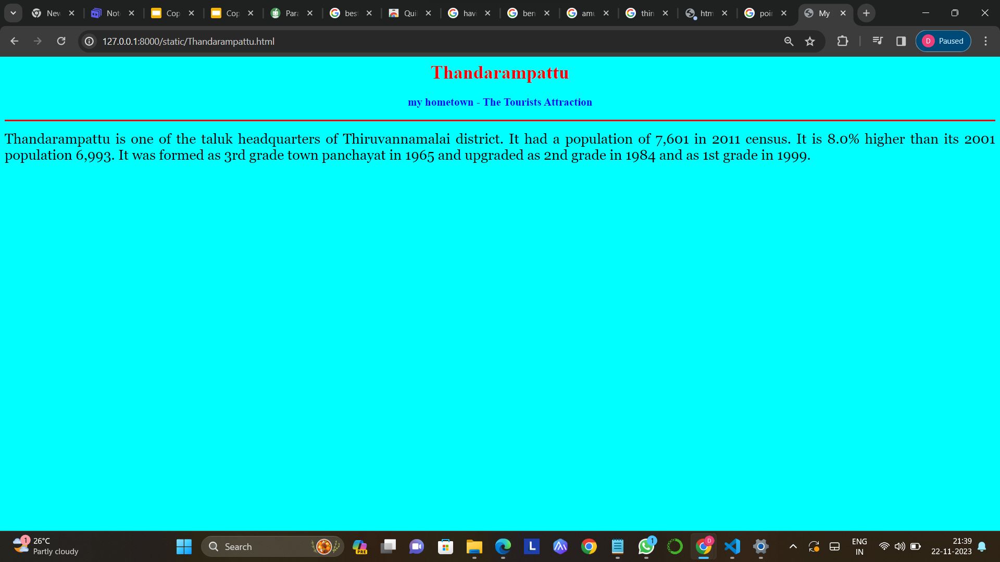

# Ex04 Places Around Me
## Date: 20/11/23

## AIM
To develop a website to display details about the places around my house.

## DESIGN STEPS

### STEP 1
Create a Django admin interface.

### STEP 2
Download your city map from Google.

### STEP 3
Using ```<map>``` tag name the map.

### STEP 4
Create clickable regions in the image using ```<area>``` tag.

### STEP 5
Write HTML programs for all the regions identified.

### STEP 6
Execute the programs and publish them.

## CODE
```
map.html

<html>
    <head>
        <title>My City</title>
    </head>
    <body>
        <h1 align="center">
            <font color=""red><b>Tiruvannamalai</b></font>
        </h1>
        <h3 align="center">
            <font color="blue"><b>Dharani dharan k (23008869)</b></font>
        </h3>
        <center>
            
            <map name="MyCity">
                <area shape="rect" coords="700,300,900,400" href="thiruvannamalai.html" title="Thiruvannamalai">
                <area shape="rect" coords="1000,250,1200,400" href="Gingee.html" title="Gingee">
                <area shape="rect" coords="700,450,1000,500" href="vettavalam.html" title="vettavalam">
                <area shape="rect" coords="500,400,600,500" href="Thanipadi.html" title="Thanipadi">
                <area shape="rect" coords="600,400,700,500" href="Thandarampattu.html" title="Thandarampattu">
        </center>
    </body>
</html>

thiruvannamalai.html

<html>
<head>
<title>My Home Town</title>
</head>
<body bgcolor="yellow">
<h1 align="center">
<font color="red"><b>Tiruvannamalai</b></font>
</h1>
<h3 align="center">
<font color="blue"><b> my hometown - The Tourists Attraction</b></font>
</h3>
<hr size="3" color="red">
<p align="justify">
<font face="Georgia" size="5">
The Temple Town of Tiruvannamalai is one of the most ancient heritage sites of India and is a centre of the Saiva religion. The Arunachala hill and its environs have been held in great regard by the Tamils for centuries. The temple is grand in conception and architecture and is rich in tradition, history and festivals.
</p>
</body>
</html>

Thandarampattu.html

<html>
<head>
<title>My Home Town</title>
</head>
<body bgcolor="cyan">
<h1 align="center">
<font color="red"><b>Thandarampattu</b></font>
</h1>
<h3 align="center">
<font color="blue"><b> neighbouring village</b></font>
</h3>
<hr size="3" color="red">
<p align="justify">
<font face="Georgia" size="5">
    Thandarampattu is one of the taluk headquarters of Thiruvannamalai district. It had a population of 7,601 in 2011 census. It is 8.0% higher than its 2001 population 6,993. It was formed as 3rd grade town panchayat in 1965 and upgraded as 2nd grade in 1984 and as 1st grade in 1999.
</p>
</body>
</html>

vettavalam.html

<html>
<head>
<title>My Home Town</title>
</head>
<body bgcolor="purple">
<h1 align="center">
<font color="red"><b>vettavalam</b></font>
</h1>
<h3 align="center">
<font color="blue"><b>neighbouring village</b></font>
</h3>
<hr size="3" color="red">
<p align="justify">
<font face="Georgia" size="5">
    Vettavalam is located at12.1°N 79.25°E. It has an average elevation of 211 metres (692 feet). Vettavalam is in between Tiruvannamalai and Villupuram NH38(Villupuram to Mangalore National Highway).
</p>
</body>
</html>

Thanipadi.html

<html>
<head>
<title>My Home Town</title>
</head>
<body bgcolor="orange">
<h1 align="center">
<font color="red"><b>Thanipadi</b></font>
</h1>
<h3 align="center">
<font color="blue"><b>neighbouring village</b></font>
</h3>
<hr size="3" color="red">
<p align="justify">
<font face="Georgia" size="5">
    Thanipadi is a panchayat town in Thandarampattu Taluk, Tiruvanamalai district, Tamil Nadu India. It is the largest and oldest town in the taluk. It was rewarded 3rd grade town panchayat in 1967 (at that time it was in Chengam taluk) and in 2001 it is rewarded 2nd grade town panchayat.
</p>
</body>
</html>

Gingee.html

<html>
<head>
<title>My Home Town</title>
</head>
<body bgcolor="pink">
<h1 align="center">
<font color="red"><b>Gingee</b></font>
</h1>
<h3 align="center">
<font color="blue"><b>neighbouring village</b></font>
</h3>
<hr size="3" color="red">
<p align="justify">
<font face="Georgia" size="5">
    The fort was later built up by the Imperial Cholas in the 13th century. It then passed from the Hoysala Emperors to the Emperors of Vijayanagara. In 1638, Gingee came under the control of the Turko-Persian Bijapur Sultanate. In 1677, the great Maratha monarch Chhatrapati Shivaji Maharaj conquered it.
</p>
</body>
</html>


```

## OUTPUT





## RESULT
The program for implementing image maps using HTML is executed successfully.
